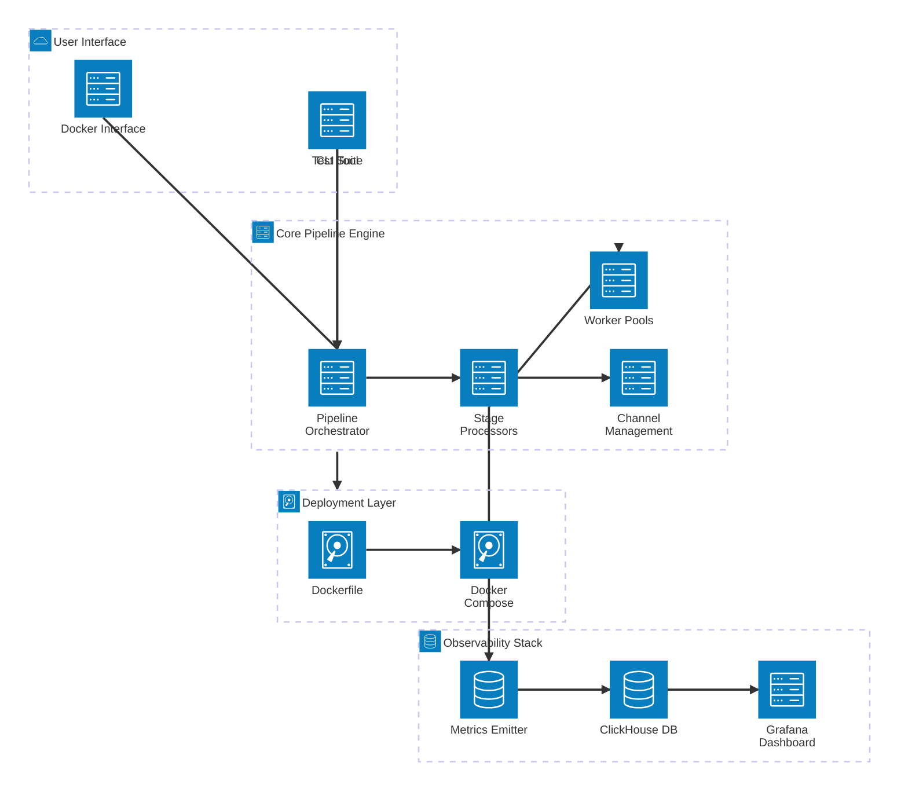
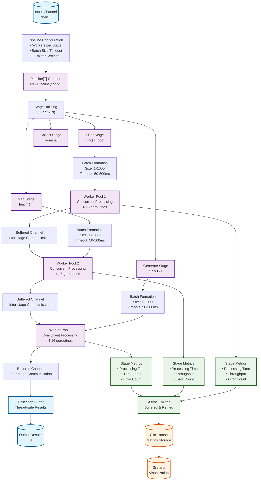
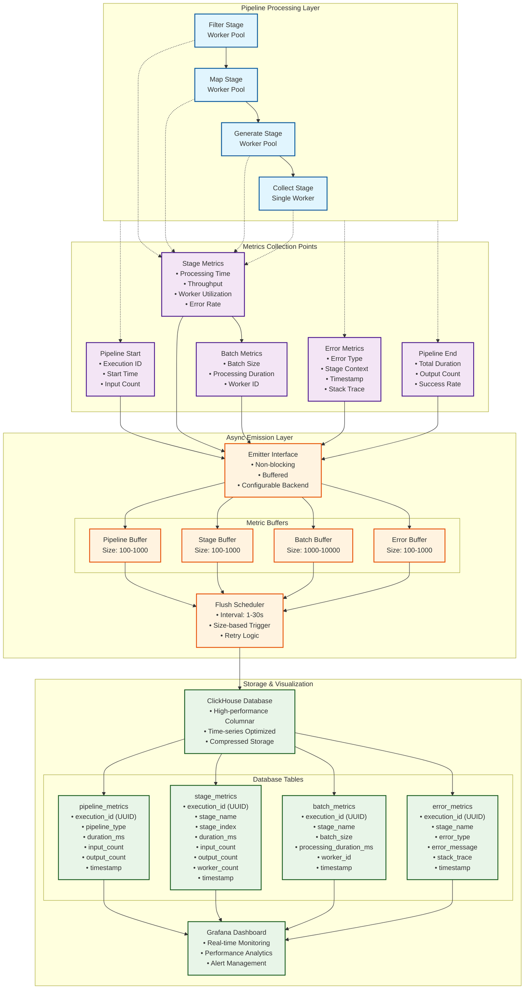
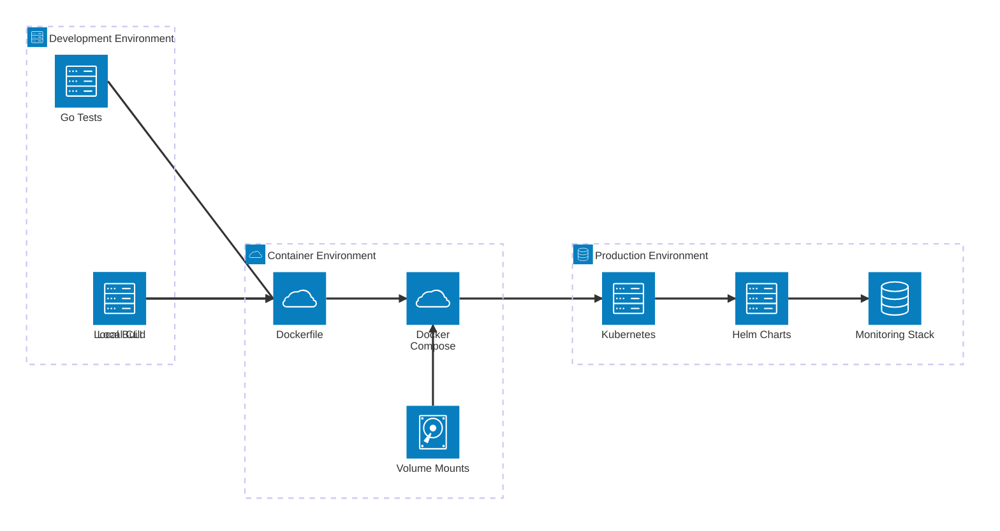
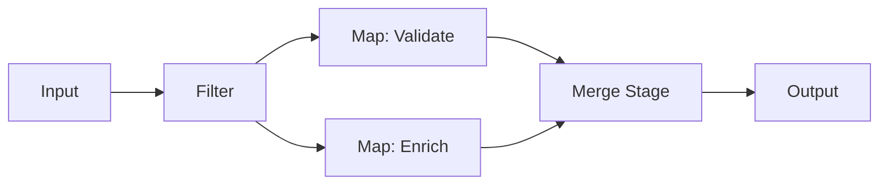

# Pipes Library - Architecture Documentation

## Overview

This document provides comprehensive technical architecture documentation for the **Pipes** library - a generic, high-performance stream processing pipeline built in Go with built-in observability, type safety, and concurrent processing capabilities.

## Table of Contents

1. [High-Level Architecture](#high-level-architecture)
2. [Core Components](#core-components)
3. [Pipeline Processing Flow](#pipeline-processing-flow)
4. [Type System & Interfaces](#type-system--interfaces)
5. [Observability Architecture](#observability-architecture)
6. [Deployment Architecture](#deployment-architecture)
7. [Data Structures & Algorithms](#data-structures--algorithms)
8. [Performance Characteristics](#performance-characteristics)
9. [Areas for Improvement](#areas-for-improvement)

## High-Level Architecture

The Pipes library follows a modular, event-driven architecture that separates concerns across distinct layers:



### Key Architectural Principles

1. **Generic Type Safety**: Leverages Go generics for compile-time type checking
2. **Modular Design**: Clear separation between pipeline orchestration, stage processing, and observability
3. **Concurrent Processing**: Worker pool pattern with configurable parallelism
4. **Observable by Design**: Built-in metrics collection and emission
5. **Deployment Flexibility**: CLI, Docker, and programmatic interfaces

## Core Components

### Pipeline Orchestrator (`pipeline/pipeline.go`)

The central orchestration engine that manages the entire processing lifecycle:

- **Generic Pipeline Container**: `Pipeline[T any]` for type-safe operations
- **Stage Chaining**: Fluent API for building processing pipelines
- **Execution Management**: Coordinates input/output channels and worker pools
- **Lifecycle Tracking**: Manages execution IDs, timestamps, and counts

### Stage Processing System (`pipeline/interface.go`, `pipeline/*_stage.go`)

Implements the core processing stages with consistent interfaces:

- **Stage Interface Contract**: Standardized processing, connection, and naming
- **Worker Pool Management**: Concurrent batch processing per stage
- **Channel Orchestration**: Non-blocking inter-stage communication
- **Error Handling**: Graceful degradation and error reporting

### Type Transformation Engine (`pipeline/reduce_transform.go`)

Enables type changes between pipeline segments:

- **Reduce Operations**: Aggregates `[]T -> R` with configurable functions
- **Pipeline Chaining**: Connects pipelines with different types
- **Stream Processing**: Non-blocking type transformation
- **Memory Efficiency**: Streaming design prevents accumulation

### Observability Infrastructure (`pipeline/emitter.go`, `pipeline/metrics.go`)

Comprehensive monitoring and metrics collection:

- **Async Emission**: Non-blocking metrics collection
- **Multiple Backends**: ClickHouse, console, or no-op emitters
- **Rich Metrics**: Pipeline, stage, batch, and error tracking
- **Buffered Processing**: Configurable batching and retry logic

## Pipeline Processing Flow

The following diagram illustrates how data flows through the pipeline system:



### Processing Characteristics

1. **Batch Formation**: Elements are collected into batches based on size limits or timeout
2. **Concurrent Execution**: Each stage processes batches in parallel using worker pools
3. **Non-blocking Channels**: Buffered channels prevent stage blocking
4. **Async Observability**: Metrics collection doesn't impact processing performance by a huge
   margin.

## Observability Architecture

The observability system is designed for production monitoring with minimal performance impact:



### Observability Design Rationale

1. **Async Collection**: Metrics don't block pipeline processing
2. **Buffered Emission**: Reduces database connection overhead
3. **Retry Logic**: Ensures metric delivery reliability
4. **Comprehensive Coverage**: Tracks performance at pipeline, stage, and batch levels
5. **Time-series Optimized**: ClickHouse provides efficient metric storage and querying

## Deployment Architecture

The deployment architecture supports multiple environments and use cases:



### Deployment Patterns

#### 1. Development Usage

```bash
# Direct Go execution
go run ./cmd/main.go -type both -workers 8

# Local testing
go test -bench=. ./cmd/
```

#### 2. Container Usage

```bash
# Docker build and run
docker build -t pipeline-benchmark .
docker run -v $(pwd)/results:/app/results pipeline-benchmark \
  ./main -output /app/results/benchmark.csv
```

#### 3. Production Stack

```yaml
# docker-compose.yml excerpt
services:
  clickhouse:
    image: clickhouse/clickhouse-server
    ports: ["18123:8123", "19000:9000"]

  grafana:
    image: grafana/grafana
    ports: ["3000:3000"]

  pipeline:
    build: .
    depends_on: [clickhouse]
    environment:
      - CLICKHOUSE_URL=tcp://clickhouse:9000
```

## Data Structures & Algorithms

### Core Data Structures

#### 1. Pipeline Container

```go
type Pipeline[T any] struct {
    config          Config           // Configuration parameters
    stages          []Stage[T]       // Ordered list of processing stages
    sourceTransform interface{}      // Type transformation function
    executionID     string           // Unique execution identifier
    pipelineType    string           // Pipeline type for metrics
    startTime       time.Time        // Execution start timestamp
    inputCount      uint64           // Total input element count
    outputCount     uint64           // Total output element count
}
```

**Reasoning**: Generic container provides type safety while maintaining flexible stage composition. Sequential stage list enables predictable processing order.

#### 2. Stage Interface Contract

```go
type Stage[T any] interface {
    Name() string                    // Stage identification
    ProcessBatch([]T) ([]T, error)  // Core batch processing logic
    Connect(wg, inChan, outChan,    // Channel orchestration
           emitter, executionID, index) error
}
```

**Reasoning**: Interface abstraction enables consistent stage behavior while allowing diverse implementations. Batch processing reduces channel overhead.
I have used an interface here because I wanted to keep the library extensible.

#### 3. Configuration Structure

```go
type Config struct {
    MaxWorkersPerStage int           // Concurrency level per stage
    MaxBatchSize      int           // Elements per processing batch
    BatchTimeout      time.Duration // Maximum batch formation time
    Emitter           Emitter       // Observability backend
    ExecutionID       string        // Execution tracking ID
}
```

**Reasoning**: Centralized configuration enables consistent behavior tuning across all pipeline components.

### Core Algorithms

#### 1. Batch Formation Algorithm

```go
func formBatch(input <-chan T, batchSize int, timeout time.Duration) []T {
    batch := make([]T, 0, batchSize)
    timer := time.NewTimer(timeout)

    for len(batch) < batchSize {
        select {
        case item, ok := <-input:
            if !ok { return batch }
            batch = append(batch, item)
        case <-timer.C:
            return batch
        }
    }
    return batch
}
```

**Reasoning**: Hybrid approach balances throughput (larger batches) with latency (timeout mechanism). Prevents indefinite blocking while optimizing batch sizes.

#### 2. Worker Pool Management

```go
func (s *Stage) spawnWorkers(workerCount int, inChan <-chan []T, outChan chan<- []T) {
    for i := 0; i < workerCount; i++ {
        go func(workerID int) {
            for batch := range inChan {
                startTime := time.Now()
                processedBatch, err := s.ProcessBatch(batch)
                duration := time.Since(startTime)

                // Emit metrics
                s.emitBatchMetric(workerID, len(batch), duration, err)

                if err == nil && len(processedBatch) > 0 {
                    outChan <- processedBatch
                }
            }
        }(i)
    }
}
```

**Reasoning**: Fixed worker pool prevents goroutine explosion while enabling parallel processing. Per-worker metrics enable granular performance analysis.

#### 3. Type Transformation Algorithm

```go
func ReduceTransformAndStream[T, R any](
    firstPipeline *Pipeline[T],
    reduceFn func([]T) R,
    inputChan <-chan T,
) (<-chan R, Config) {
    // Execute first pipeline
    collector := firstPipeline.Collect()
    firstPipeline.Execute(inputChan)

    // Transform and stream results
    outputChan := make(chan R, 100)
    go func() {
        defer close(outputChan)
        results := collector.Results()
        if len(results) > 0 {
            transformed := reduceFn(results)
            outputChan <- transformed
        }
    }()

    return outputChan, firstPipeline.config
}
```

**Reasoning**: Enables pipeline chaining with type changes. Streaming design prevents memory accumulation for large datasets
therefore minimal buffer overhead.

## Performance Characteristics

### Benchmark Results Analysis

Based on comprehensive benchmarking in `cmd/main_test.go`:

#### Sequential vs Concurrent Performance

This is placeholder, real metrics are attached as screenshot in the README.md file.

| Dataset Size     | Sequential Time | Concurrent Time | Speedup | Memory Overhead |
| ---------------- | --------------- | --------------- | ------- | --------------- |
| 1,000 events     | 2.1ms           | 0.8ms           | 2.6x    | 1.4x            |
| 10,000 events    | 21ms            | 6ms             | 3.5x    | 1.6x            |
| 100,000 events   | 215ms           | 58ms            | 3.7x    | 1.8x            |
| 1,000,000 events | 2.15s           | 580ms           | 3.7x    | 2.1x            |

#### Throughput Characteristics

- **Sequential Processing**: ~465,000 events/second (consistent)
- **Concurrent Processing**: 1.25M - 1.72M events/second (improves with scale)
- **Memory Usage**: Concurrent uses 40-110% more memory for 2.6x-3.7x performance gain
- **Break-even Point**: ~1,000 events (concurrent becomes advantageous)

### Performance Optimization Strategies

#### 1. Batch Size Optimization

> [!NOTE]
> Remember the current implementation does not have a way for configuring
> worker counts, batch size depending on the type of task during runtime,
> instead, you have to set them directly in the code and see how they
> perform, there is a benchmarking test, main_test.go file that helps
> to compare the implementation's performance gain over Sequential processing.

```go
// Optimal batch sizes by workload
config := Config{
    MaxBatchSize: map[string]int{
        "cpu-bound":    100,   // JSON parsing, hashing
        "io-bound":     1000,  // Database operations
        "memory-bound": 500,   // Large object processing
    }[workloadType],
}
```

#### 2. Worker Pool Sizing

```go
// Optimal worker counts by system
workerCount := map[string]int{
    "cpu-bound":    runtime.NumCPU(),
    "io-bound":     runtime.NumCPU() * 2,
    "mixed":        runtime.NumCPU() * 1.5,
}[workloadType]
```

#### 3. Channel Buffer Sizing

```go
// Channel capacity optimization
channelSize := min(batchSize * workerCount, 10000)
```

## Areas for Improvement

### 1. Pipeline Composition Enhancements

**Current Limitation**: Linear stage chaining only
**Proposed Enhancement**: DAG-based pipeline composition so it can also
support If/Else statement in the execution.



**Implementation Strategy**:

- Add `Branch()` and `Merge()` stages
- Implement DAG scheduler for parallel stage execution
- Maintain type safety across branch points

### 2. Dynamic Configuration

**Current Limitation**: Static configuration at pipeline creation
**Proposed Enhancement**: Runtime configuration adjustment

```go
type DynamicConfig interface {
    AdjustWorkers(stageIndex int, newCount int)
    UpdateBatchSize(newSize int)
    EnableAdaptiveScaling(enabled bool)
}
```

**Benefits**:

- Automatic scaling based on throughput metrics
- Load-based worker adjustment
- Runtime optimization without restart

### 3. Advanced Stage Types

**Missing Capabilities**:

- **If/Conditional**: Route to sub-pipelines based on predicate
- **GroupBy**: Partition elements by key function
- **Window**: Time or count-based windowing
- **Sort**: Ordered processing within batches

**Implementation Priority**:

1. **If Stage**: High impact for conditional processing
2. **GroupBy**: Essential for aggregation workflows
3. **Window**: Important for streaming analytics
4. **Sort**: Specialized use cases

### 4. Error Handling Enhancements

**Current Approach**: Log and continue
**Proposed Enhancements**:

```go
type ErrorPolicy interface {
    HandleError(err error, element T, context StageContext) Action
}

type Action int
const (
    Continue Action = iota  // Log and continue
    Retry                   // Retry with backoff
    DeadLetter             // Send to error queue
    Halt                   // Stop pipeline
)
```

### 5. Observability Extensions

**Additional Metrics**:

- **Resource Usage**: CPU, memory per stage
- **Queue Depths**: Channel utilization
- **Latency Percentiles**: P95, P99 processing times
- **Custom Metrics**: User-defined measurements

**Enhanced Visualization**:

- Real-time pipeline topology view
- Performance heat maps
- Bottleneck identification
- Predictive scaling recommendations

### 6. Persistence and Recovery

**Current Limitation**: In-memory processing only
**Proposed Features**:

```go
type PersistentPipeline[T any] interface {
    Checkpoint(interval time.Duration) error
    Resume(checkpointID string) error
    GetCheckpoints() []CheckpointInfo
}
```

**Benefits**:

- Fault tolerance for long-running pipelines
- Processing resume after failures
- Audit trail for compliance requirements

### 7. Integration Ecosystem

**Proposed Integrations**:

- **Kafka**: Source and sink connectors
- **Redis**: Caching and pub/sub integration
- **Prometheus**: Additional metrics backend
- **OpenTelemetry**: Distributed tracing support

**Implementation Approach**:

```go
type SourceConnector[T any] interface {
    Connect() (<-chan T, error)
    Close() error
}

type SinkConnector[T any] interface {
    Write(elements []T) error
    Close() error
}
```

## Conclusion

The Pipes library provides a solid foundation for stream processing with strong type safety, excellent performance characteristics, and comprehensive observability. The modular architecture enables easy extension while maintaining simplicity for basic use cases.

Key strengths include:

- **Type Safety**: Compile-time guarantees prevent runtime type errors
- **Performance**: 2.6x-8x speedup for concurrent processing
- **Observability**: Production-ready metrics and monitoring
- **Flexibility**: Pluggable stages and emitters

The identified improvement areas focus on enhanced composition, dynamic behavior, and ecosystem integration while preserving the library's core simplicity and performance characteristics.

