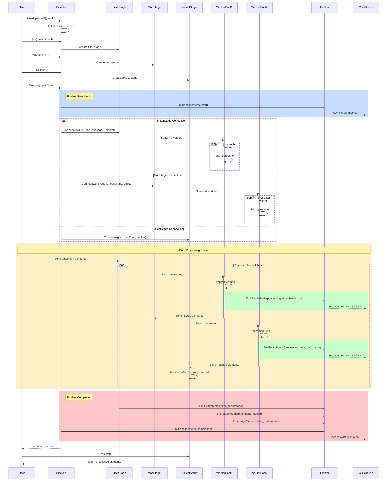
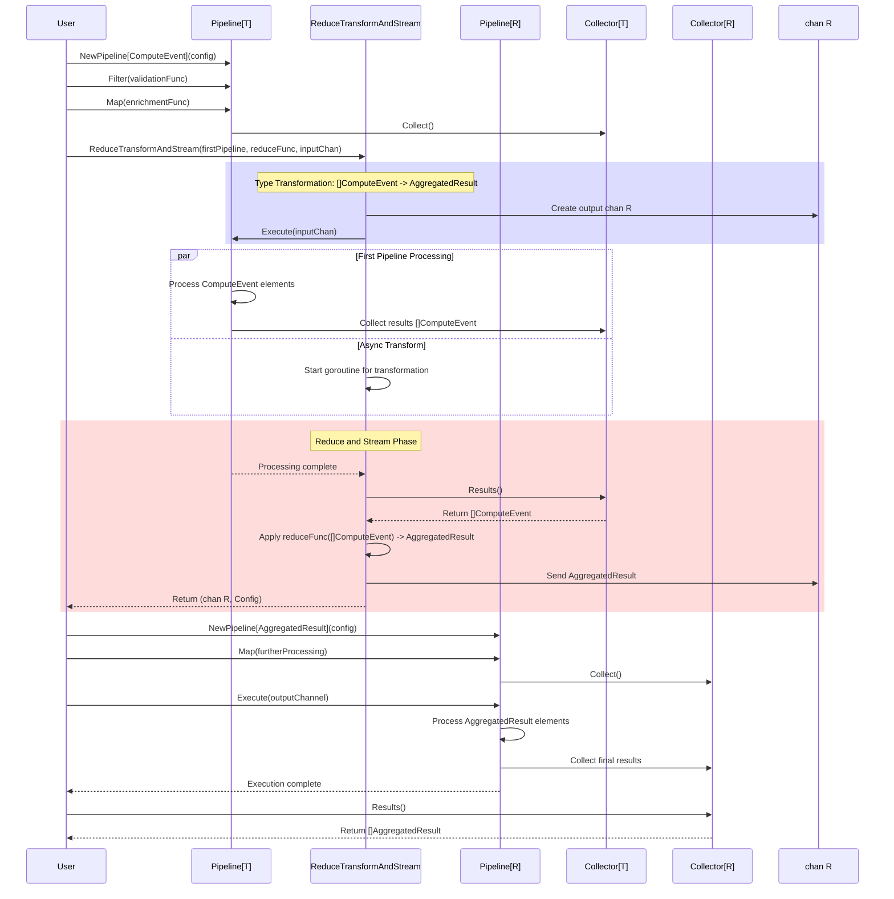
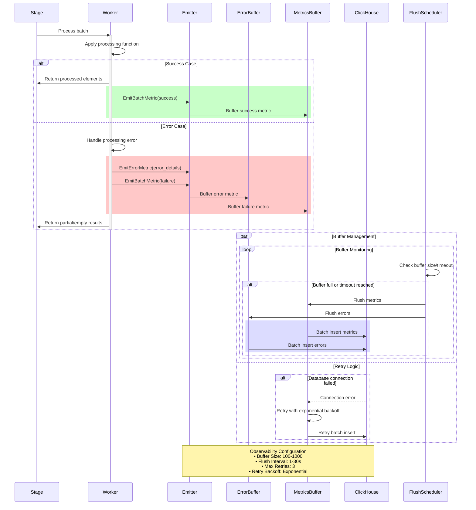
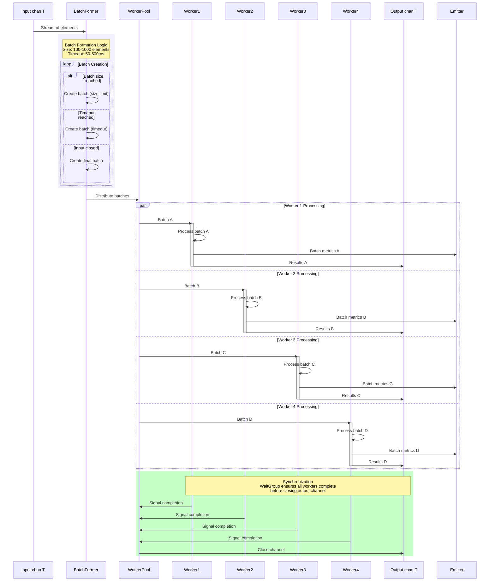

# Pipeline Execution Flow Diagrams

This document contains detailed sequence diagrams showing the execution flow of the Pipes library.

## Pipeline Execution Sequence

## Type Transformation Sequence

## Error Handling and Observability Flow

## Concurrent Processing Pattern

